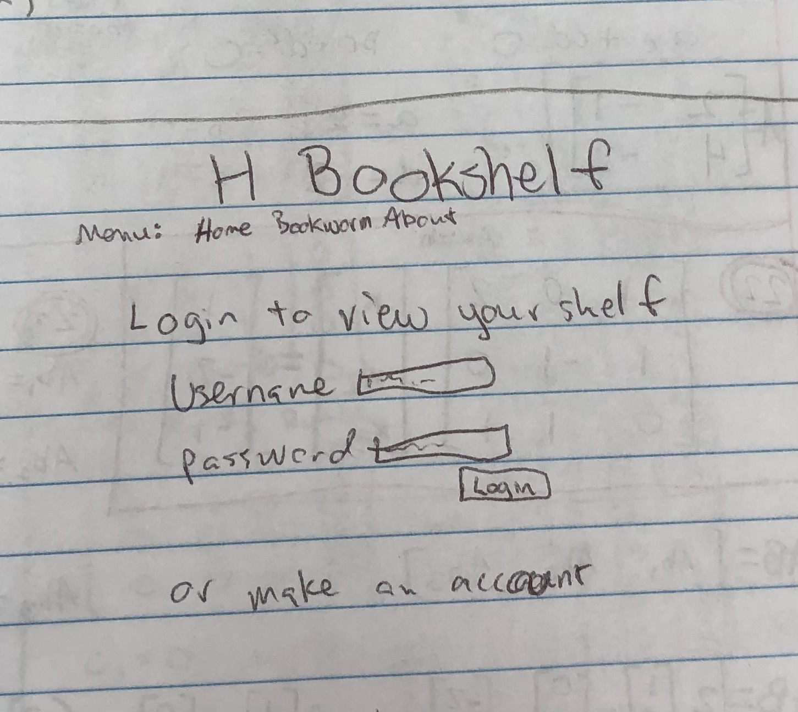

# startup: H Bookshelf
Startup application for BYU CS 260

## Specification Deliverable

### Elevator Pitch
Have you ever borrowed a book from your friend and forgot that you had it? Or maybe you were halfway through one when you decided to start another? This is no longer a problem because you can track the books you are reading on My Reads. Users can login to add, remove, or view the books they are currenlty reading to their bookshelf. They can connect to other readers by seeing in real time when other users add or remove books from their shelves. Readers never have to forget their books ever again.

### Key Features
- login
- view bookshelf
- add or remove books from shelf
- bookshelf saved with each login
- can see in realtime when all other users add or remove a book from their shelf
- leaderboard for books finished

### Technologies
- HTML: I'll have pages for login, number of finished books, and seeing your books.
- CSS: Make the web page look good on screens that are different sizes.
- JavaScript: Login and add/remove book buttons actually do stuff.
- Service: will incorporate something fun to website that makes it look more fun.
- Database/Login: People can make an account and securely login to their own bookshelf. Login info, book totals, and top readers are saved.
- WebSocket: Connects users to show the messages saying someone added or removed a book from their library.
- React: Application ported to use React web framework.

### Design
This is what the login and shelf pages will look like.

## HTML
I made the structure of my application using HTML.
- HTML pages - I have 4 HTML pages representing login, your bookshelf, leaderboard, and about. 
- Links - The login page automatically links to the page with your shelf. Links at the top of the page allow you to choose which page to view.
- Text - My about page explains the purpose of the application.
- 3rd party placeholder - Image on myshelf.html page will have art from Art Institute of Chicago
- Images - An image of a book is on the about HTML page.
- DB/Login- Login represented by input box and submit button. The leaderboard and your saved books represent data pulled from the database.
- WebSocket - The statements that display when someone starts or finishes a book are realtime.